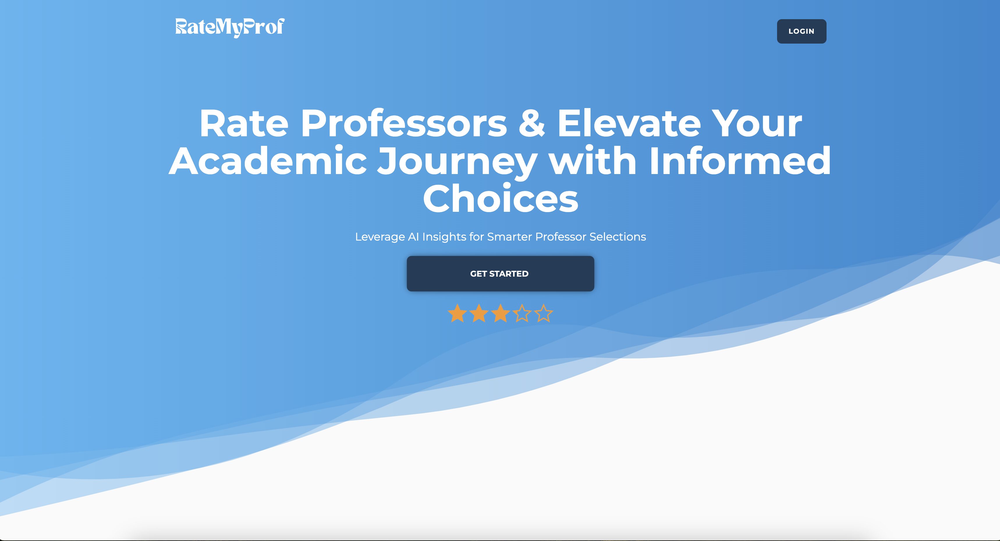
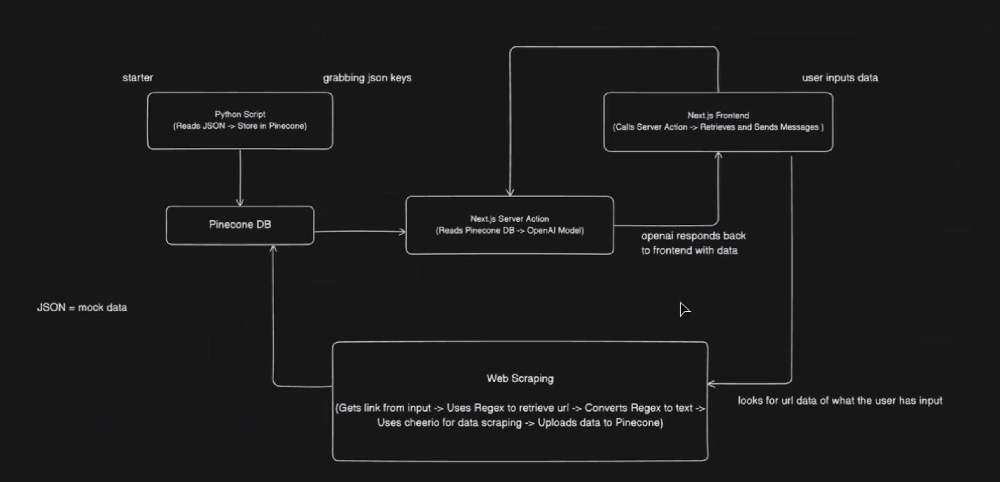
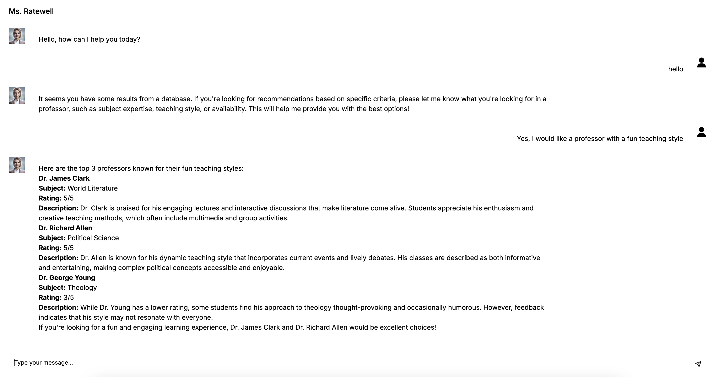

# Rate My Professor AI Assistant

In this project we learned how to use Retrieval-Augmented Generation (RAG) to improve AI-powered applications to provide accurate, context-aware responses. Built using **Next.js**, **Clerk for auth**, **Pinecone**, and the **OpenAI API**.

    

## How It Works

- **Vector Database (Pinecone)**: We store and manage professor reviews as vectors which allows efficient search and retrieval.
- **OpenAI for Language Understanding**: OpenAI powers the natural language responses so that it makes the interactions feel more human-like.
- **Mock Data**: We use sample reviews to simulate real-world usage to demonstrate how RAG can imporve decision-making by providing detailed insights.

    

### Chat Interface Example

The following is an example of an interaction between a chatbot and a user

    

